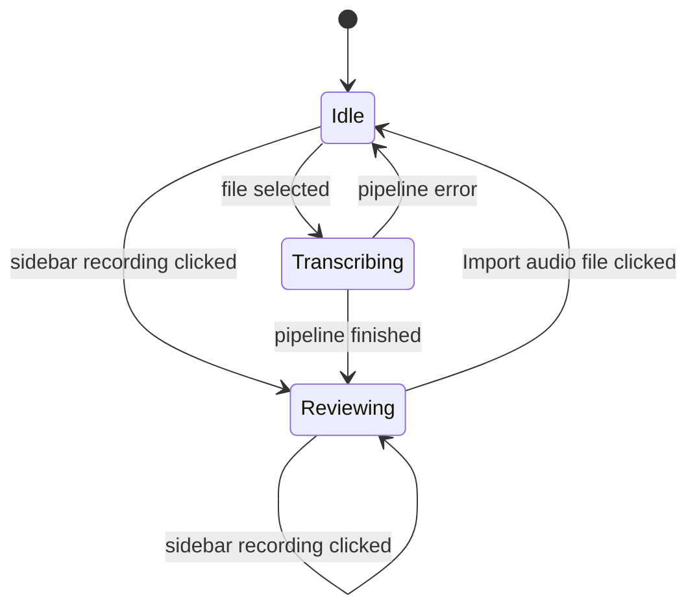
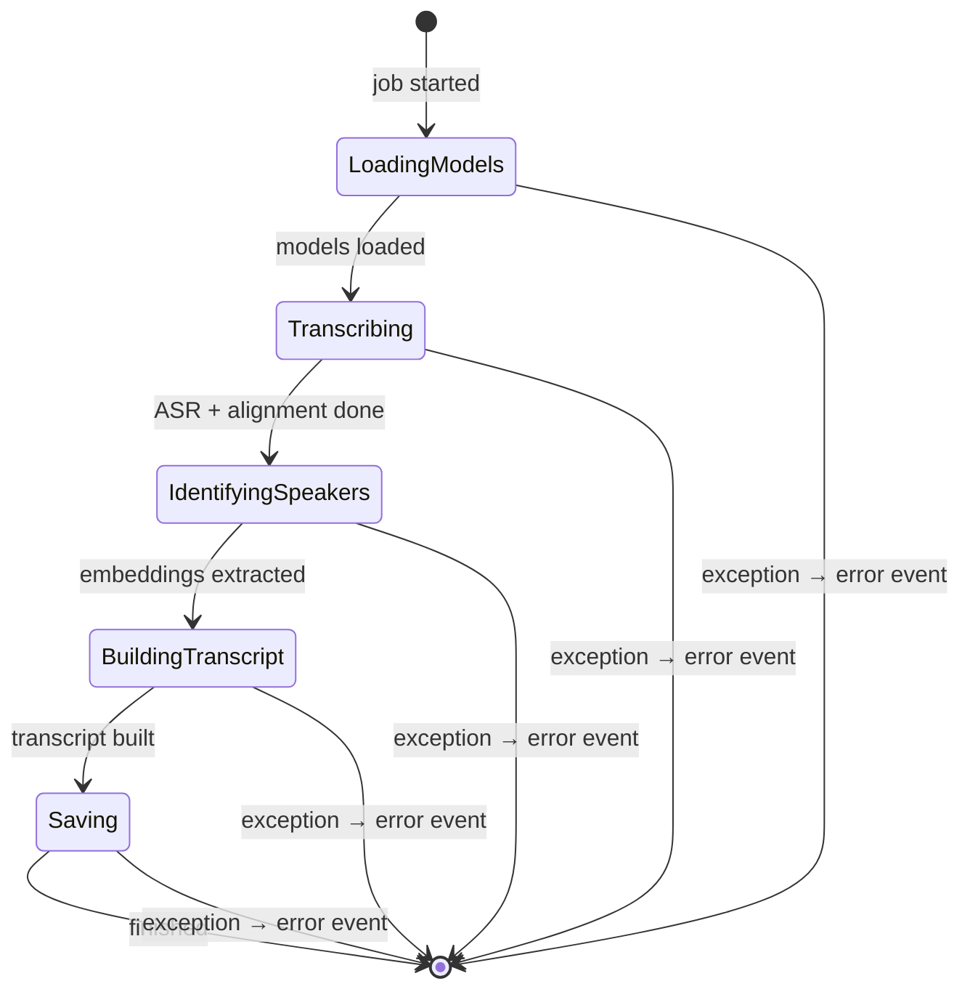
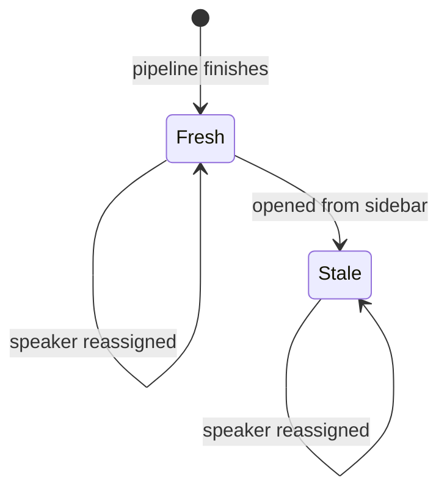
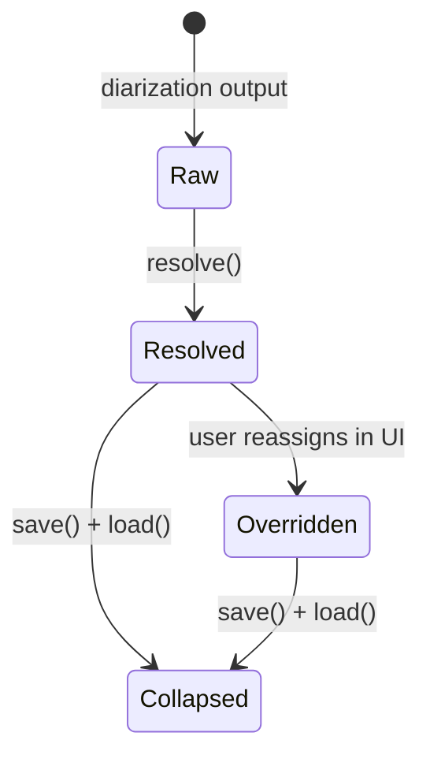

# State Machines

Key state machines in the system — places where explicit states exist, transitions have defined triggers, and current state determines what actions are valid.

---

## 1. App Session

The Electron app routes between views via the view router in `app.js`.

**Idle** — `ImportView` is shown. No active transcript. Accepts file picker.

**Transcribing** — `ProgressView` is shown. Pipeline runs via `POST /transcribe` API in a `ThreadPoolExecutor` thread. Progress is streamed over WebSocket. No user interaction with transcript is possible.

**Reviewing** — `EditorView` is shown with a real `Transcript`. User can edit speakers and reassign speaker identity. Clicking any recording in the left sidebar loads it from the database and replaces the current editor. This transition is available from both Idle and Reviewing.

---

## 2. ML Pipeline

The pipeline runs inside a `ThreadPoolExecutor` thread (called from `POST /transcribe`). Any unhandled exception at any step is caught and returned as an error event over the WebSocket.

Each step sends a progress message over WebSocket, displayed in `ProgressView`.

| Step | Key calls |
|---|---|
| Loading models | `SpeakerMemoryService()`, `EmbeddingService()`, `TranscriptionService()` |
| Transcribing | `TranscriptionService.transcribe()` — WhisperX ASR + alignment + diarization |
| Identifying speakers | `EmbeddingService.extract_all()` → `SpeakerMemoryService.resolve()` |
| Building transcript | `TranscriptBuilder.build()` → `TranscriptBuilder.attach_embeddings()` |
| Saving | `TranscriptStorageService.save()` → `ArchiveService.archive()` |

---

## 3. Transcript Lifecycle

A `Transcript` moves through states from creation to persistent speaker memory.

**Fresh** — just created by the pipeline. `db_id` is set. Per-segment `embedding` values are present in memory. `status = 'draft'`. Speaker reassignment in this state triggers `CommitService` and updates long-term speaker memory.

**Stale** — loaded from the sidebar (DB). Per-segment `embedding` values are restored from the `segments.embedding` BLOB column, so they are present on all segments just like in Fresh. Speaker reassignment in this state triggers `CommitService` and updates long-term speaker memory — `commit()` is reachable on loaded transcripts.

:::note
`Transcript.status` is always `'draft'`. The Committed state is implicit — it exists only as an effect on `speaker_memory.db` and is not recorded anywhere.
:::

:::note[Non-speaker edits bypass the commit pipeline]
Inline segment text edits (`update_segment_text`) and segment deletes (`delete_segment`) write directly to the `segments` table via `TranscriptStorageService` and do **not** invoke `CommitService`. They never mutate `speaker_memory.db`. Only speaker reassignment goes through `CommitService.commit()` (see [I2](./invariants.md#i2--only-commitservicecommit-writes-to-speaker-memory)).
:::

---

## 4. Segment: Speaker Identity

Each `Segment` carries three speaker fields. Their priority is fixed.

**Effective speaker** = `speaker_final ?? speaker_resolved ?? speaker_raw`

| Field | Set by | Stable across sessions |
|---|---|---|
| `speaker_raw` | `TranscriptionService` — diarization | No — `SPEAKER_00` can be a different person next run |
| `speaker_resolved` | `SpeakerMemoryService.resolve()` — cosine similarity matching | Yes, if similarity ≥ 0.75 |
| `speaker_final` | User action in UI | Yes — explicit user decision |

**Collapsed** is not a named state in the code — it describes what happens after `save()` + `load()`. `TranscriptStorageService` stores only the effective speaker in the `speaker_id` column and restores it into `speaker_resolved`. `speaker_final` is always `None` after load. The distinction between "auto-matched" and "user-corrected" is permanently lost.

:::note
`resolve()` is a pure function — it never mutates `SpeakerMemoryService.known_speakers`. The Raw → Resolved transition is the only moment in the pipeline where speaker matching runs automatically.
:::

---

## Cross-Layer Notes

- **Segment speaker transitions (Resolved → Overridden) only have a lasting effect while the Transcript is Fresh.** Once Stale, speaker reassignments update the DB record but do not update long-term memory.
- **The App Session's Reviewing state is the only context in which Transcript and Segment state transitions can occur.** Transcribing is read-only from the user's perspective.
- **resolve()** (the Raw → Resolved transition for all segments) runs exactly once — inside the pipeline, before the user ever sees the transcript.
