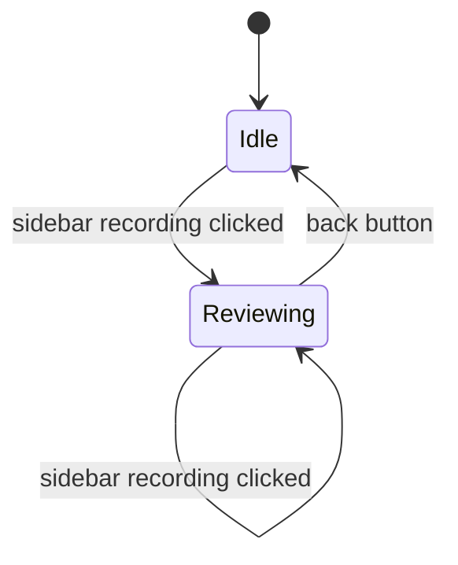
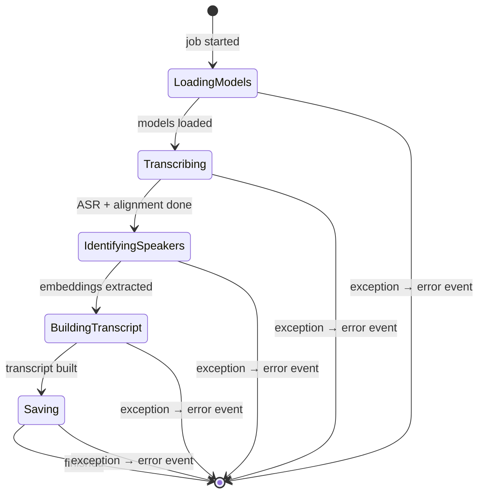
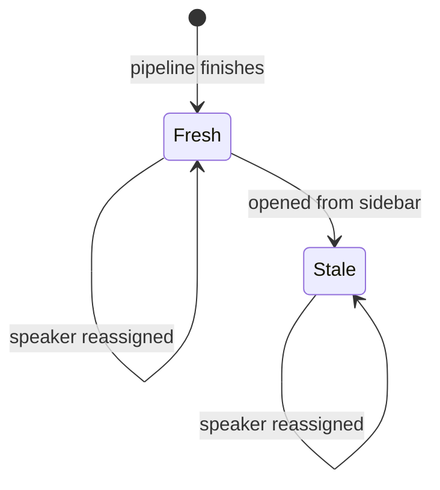
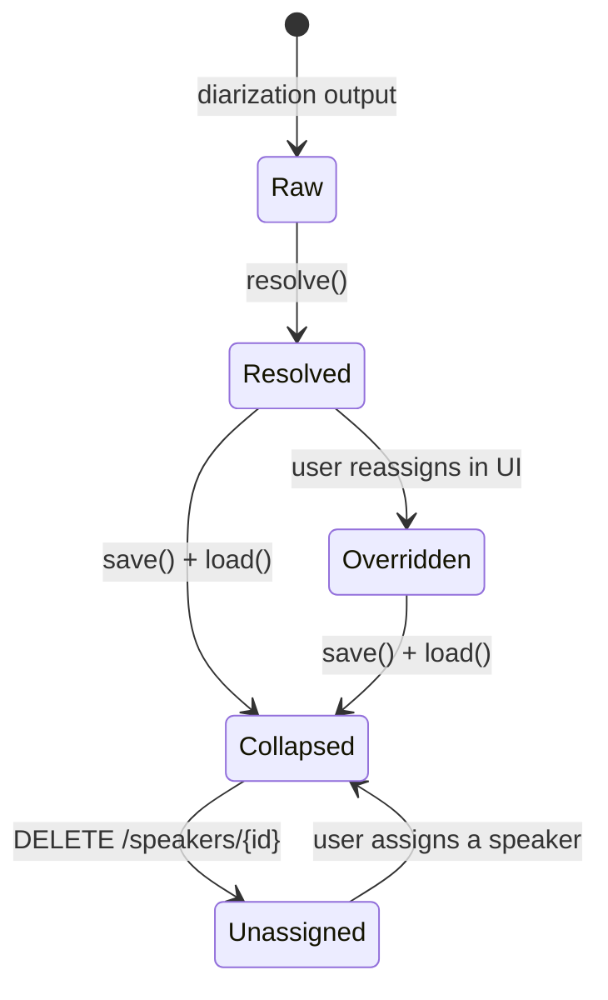

# State Machines

Key state machines in the system — places where explicit states exist, transitions have defined triggers, and current state determines what actions are valid.

---

## 1. App Session

The Electron app routes between views via the view router in `app.js`. Transcription jobs run in the background and never block navigation — there is no dedicated "Transcribing" view state.

```mermaid
stateDiagram-v2
    [*] --> Idle

    Idle --> Reviewing : sidebar recording clicked
    Reviewing --> Idle : back button
    Reviewing --> Reviewing : sidebar recording clicked
```

**Idle** — Home screen is shown. No active transcript. Accepts file picker or new recording modal.

**Reviewing** — `EditorView` is shown with a real `Transcript`. User can edit speakers and reassign speaker identity. Clicking any recording in the left sidebar loads it from the database and replaces the current editor. Available from both Idle and Reviewing.

**Background queue (orthogonal to navigation state)** — Any number of transcription jobs can run concurrently with navigation. Jobs are tracked in `app._activeJobs` (`Map<jobId, job>`) and displayed as cards in the sidebar queue section above the recordings list. On completion a toast is shown and the sidebar refreshes. See [Electron UI → Background transcription queue](../ui/electron/overview.md#background-transcription-queue).

---

## 2. ML Pipeline

The pipeline runs inside a `ThreadPoolExecutor` thread (called from `POST /transcribe`). Any unhandled exception at any step is caught and returned as an error event over the WebSocket.

```mermaid
stateDiagram-v2
    [*] --> LoadingModels : job started

    LoadingModels --> Transcribing : models loaded
    Transcribing --> IdentifyingSpeakers : ASR + alignment done
    IdentifyingSpeakers --> BuildingTranscript : embeddings extracted
    BuildingTranscript --> Saving : transcript built
    Saving --> [*] : finished

    LoadingModels --> [*] : exception → error event
    Transcribing --> [*] : exception → error event
    IdentifyingSpeakers --> [*] : exception → error event
    BuildingTranscript --> [*] : exception → error event
    Saving --> [*] : exception → error event
```

Each step sends a progress message over WebSocket, displayed in the sidebar job card.

| Step | Key calls |
|---|---|
| Loading models | `SpeakerMemoryService()`, `EmbeddingService()`, `TranscriptionService()` |
| Transcribing | `TranscriptionService.transcribe()` — WhisperX ASR + alignment + diarization |
| Identifying speakers | `EmbeddingService.extract_all()` → `SpeakerMemoryService.resolve()` |
| Building transcript | `TranscriptBuilder.build()` → `TranscriptBuilder.attach_embeddings()` |
| Saving | `TranscriptStorageService.save()` → `ArchiveService.archive()` |

---

## 3. Transcript Lifecycle

A `Transcript` moves through states from creation to persistent speaker memory.

```mermaid
stateDiagram-v2
    [*] --> Fresh : pipeline finishes

    Fresh --> Fresh : speaker reassigned
    Fresh --> Stale : opened from sidebar
    Stale --> Stale : speaker reassigned
```

**Fresh** — just created by the pipeline. `db_id` is set. Per-segment `embedding` values are present in memory. `status = 'draft'`. Speaker reassignment in this state triggers `CommitService` and updates long-term speaker memory.

**Stale** — loaded from the sidebar (DB). Per-segment `embedding` values are restored from the `segments.embedding` BLOB column, so they are present on all segments just like in Fresh. Speaker reassignment in this state triggers `CommitService` and updates long-term speaker memory — `commit()` is reachable on loaded transcripts.

:::note
`Transcript.status` is always `'draft'`. The Committed state is implicit — it exists only as an effect on `speaker_memory.db` and is not recorded anywhere.
:::

:::note[Non-speaker edits bypass the commit pipeline]
Inline segment text edits (`update_segment_text`) write directly to the `segments` table via `TranscriptStorageService` and do **not** invoke `CommitService`. Segment and transcript deletes remove audio from the DB, so they call `CommitService.recompute_or_remove()` for the affected speakers to keep embeddings consistent with the remaining segments. Speaker reassignment goes through `CommitService` (see [I2](./invariants.md#i2--only-commitservice-writes-speaker-embeddings)).
:::

---

## 4. Segment: Speaker Identity

Each `Segment` carries three speaker fields. Their priority is fixed.

```mermaid
stateDiagram-v2
    [*] --> Raw : diarization output

    Raw --> Resolved : resolve()

    Resolved --> Overridden : user reassigns in UI

    Resolved --> Collapsed : save() + load()
    Overridden --> Collapsed : save() + load()

    Collapsed --> Unassigned : DELETE /speakers/{id}
    Unassigned --> Collapsed : user assigns a speaker
```

**Effective speaker** = `UNASSIGNED` if `unassigned`, else `speaker_final ?? speaker_resolved ?? speaker_raw`

| Field | Set by | Stable across sessions |
|---|---|---|
| `speaker_raw` | `TranscriptionService` — diarization | No — `SPEAKER_00` can be a different person next run |
| `speaker_resolved` | `SpeakerMemoryService.resolve()` — cosine similarity matching | Yes, if similarity ≥ 0.75 |
| `speaker_final` | User action in UI | Yes — explicit user decision |

**Raw is never persisted.** `resolve()` maps only diarization speakers that have an embedding (enough speech). `TranscriptBuilder.build()` gives every other `SPEAKER_XX` its own new UUID (one per label per transcript — an unnamed speaker without a voice profile), and segments with no diarization speaker at all (`UNKNOWN`) start as **Unassigned**. Transcript schema v6 applied the same rule to rows saved before it, so a stored segment always has either a UUID or the unassigned flag.

**Unassigned** — the segment's speaker was deleted (`CommitService.delete_speaker()`). `segments.speaker_id` is `NULL` and `segments.unassigned = 1` (transcript schema v5); the same state is used for segments diarization gave no speaker. The segment does not fall back to `speaker_raw`, feeds no voice profile, and is never committed. Assigning a speaker to it — one segment or all unassigned segments of a transcript at once — sets `speaker_id` and clears the flag.

**Collapsed** is not a named state in the code — it describes what happens after `save()` + `load()`. `TranscriptStorageService` stores only the effective speaker in the `speaker_id` column and restores it into `speaker_resolved`. `speaker_final` is always `None` after load. The distinction between "auto-matched" and "user-corrected" is permanently lost.

:::note
`resolve()` is a pure function — it never mutates `SpeakerMemoryService.known_speakers`. The Raw → Resolved transition is the only moment in the pipeline where speaker matching runs automatically.
:::

---

## Cross-Layer Notes

- **Segment speaker transitions (Resolved → Overridden) only have a lasting effect while the Transcript is Fresh.** Once Stale, speaker reassignments update the DB record but do not update long-term memory.
- **The App Session's Reviewing state is the only context in which Transcript and Segment state transitions can occur.** Background transcription jobs do not affect the current editor state.
- **resolve()** (the Raw → Resolved transition for all segments) runs exactly once — inside the pipeline, before the user ever sees the transcript.
